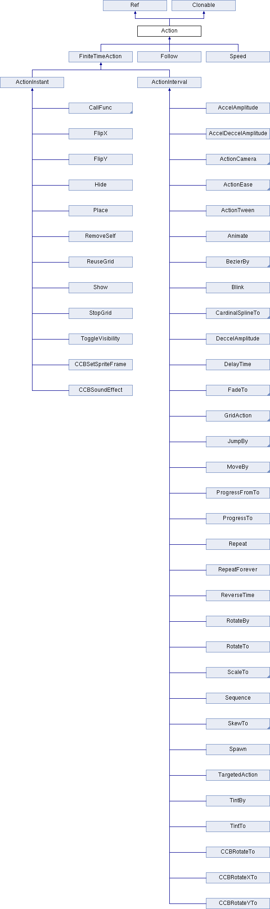

#Action

## 继承图


## eg
```
star->runAction(Sequence::create(DelayTime::create(0.2f),
                           CallFuncN::create(CC_CALLBACK_1(Spa::callback, this)),NULL));

auto d1 = DelayTime::create(0.5f);
auto c1 = CallFuncN::create(CC_CALLBACK_0(SpaPet::stopAnimation, this));
this->runAction(Sequence::create(d1,c1, nullptr));

```

